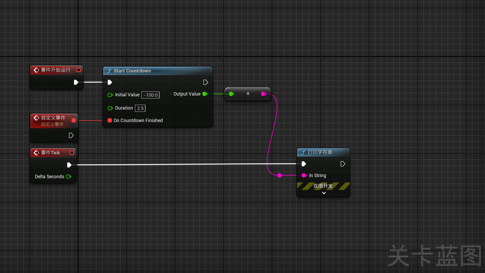

# MathTimeCountdown

MathTimeCountdown is an Unreal Engine plugin that provides a flexible countdown timer system. The plugin allows developers to start a countdown with an initial value, define its duration, and handle events when the countdown completes.

## Features
- **Custom Countdown**: Start a countdown timer with a specified initial value and duration.
- **Frame-by-Frame Updates**: Tracks the countdown's progress at 30 frames per second.
- **Completion Event**: Trigger custom actions or logic when the countdown reaches zero.
- **Blueprint Callable**: Fully integrated into Unreal Engine's Blueprint system for easy use in both C++ and Blueprint projects.

## Requirements
- Unreal Engine 4.26 or later.

## Installation

### Option 1: Clone the Repository
1. Clone this repository to your local machine.
   ```bash
   git clone https://github.com/<your-username>/MathTimeCountdown.git
   ```
2. Place the `MathTime` folder inside your project's `Plugins` directory.
3. Open your Unreal Engine project.
4. Go to **Edit > Plugins** and enable `MathTimeCountdown`.

### Option 2: Manual Download
1. Download the repository as a ZIP file and extract it.
2. Place the `MathTime` folder into your Unreal project under `Plugins/`.
3. Enable the plugin in **Edit > Plugins**.

## Usage



### 1. Using the Countdown in Blueprints
- Navigate to your Blueprint Editor and access the `StartCountdown` function from the `MathTimeFunctionLibrary`.
- Set the initial countdown value and the countdown duration.
- Bind any events to the countdown completion delegate to execute custom actions when the timer finishes.

### 2. Using the Countdown in C++
1. Include the MathTime header:
   ```cpp
   #include "MathTimeFunctionLibrary.h"
   ```
2. Start a countdown with the following call:
   ```cpp
   float OutputValue;
   UMathTimeFunctionLibrary::StartCountdown(InitialValue, Duration, OutputValue, OnCountdownFinishedDelegate);
   ```

### Example Blueprint
1. Add a **StartCountdown** node in your Blueprint.
2. Set the **Initial Value** and **Duration**.
3. Bind an event to execute when the countdown finishes.

### Example C++
```cpp
float OutputValue;
FCountdownFinishedDelegate CountdownFinished;
CountdownFinished.BindLambda([]() {
    UE_LOG(LogTemp, Warning, TEXT("Countdown Finished!"));
});
UMathTimeFunctionLibrary::StartCountdown(10.0f, 5.0f, OutputValue, CountdownFinished);
```

## Customization
- You can adjust the frame rate by modifying the **FramesPerSecond** constant inside the plugin.
- Customize the actions taken when the countdown finishes by binding a different delegate.

## Contributing
Contributions are welcome! Please follow these steps:
1. Fork the repository.
2. Create a new branch (`git checkout -b feature/my-feature`).
3. Commit your changes (`git commit -am 'Add new feature'`).
4. Push to the branch (`git push origin feature/my-feature`).
5. Create a pull request.
